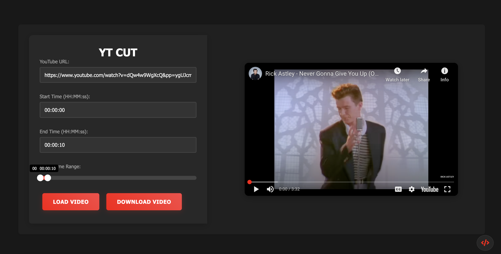

<div align="center">
  <h1>YT Cut</h1>
  <p>A modern YouTube video trimmer with precise timestamp control</p>

  [](LICENSE)
  [](docker-compose.yml)
  [](https://developers.google.com/youtube/v3)
</div>

## 🎥 About

YT Cut is a powerful web application that allows you to easily trim YouTube videos with precise timestamp control. Perfect for content creators, educators, and anyone who needs specific segments from YouTube videos.

## ✨ Features

- 🎯 Precise timestamp control with interactive slider
- 🎨 Modern dark mode interface
- 🚀 Fast video processing
- 📱 Responsive design
- 🔒 Secure download handling
- 🐳 Docker support for easy deployment

## 🖥 Screenshot

<div align="center">
  
</div>

## 🚀 Quick Start

### Using Docker (Recommended)
```bash
# Clone the repository
git clone https://github.com/yourusername/yt-cut.git
# Navigate to project directory
cd yt-cut
# Start the application
docker-compose up --build
```

---

### Manual Setup & Usage
#### Setup Steps
1. **Backend:**
```bash
cd backend
python -m venv venv
source venv/bin/activate # For Mac/Linux
pip install -r requirements.txt
python server.py
```
Frontend:
- Serve using any static file server
- Navigate to http://localhost:8080
- Paste YouTube URL
- Select time range using slider
- Click Download button

---

## Tech Stack
- **Backend:** Python/Flask, yt-dlp, MoviePy, DevOps, Docker, Nginx  
- **Frontend:** HTML5/CSS3, JavaScript ES6+, YouTube IFrame API, noUiSlider  

---

## 📜 License

Distributed under the MIT License. See [`LICENSE`](./LICENSE) for more information.

## 🙏 Acknowledgements

Special thanks to:
- GitHub Copilot for code suggestions and optimizations
- The open-source community for the amazing tools and libraries
